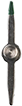

# Custom Compass Steps

Steps to create a custom compass widget!

## 1. Explore the file structure

- `/custom-compass-start/`
  - `/app/`: Folder for the widget and assets
    - `/css/`: Widget styling
      - [`main.css`](app/css/main.css): App styling
      - [`CustomCompass.css`](app/css/CustomCompass.css): Compass styling
    - `/img/`: Widget Image files. Background, needle, etc.
    - [`CustomCompass.tsx`](app/CustomCompass.tsx): The custom compass widget view. Should be empty for the demo.
    - [`main.ts`](app/main.ts): File to load and configure the widget as well as the application
  - [`index.html`](index.html): Root application page

## 2. Preview the index page

Open the [index page](http://localhost/git/dev-summit-2019-customizing-widgets/demos/custom-compass-start/) in your web browser.

## 3. Download the Compass View

Copy the `Compass.tsx` view code and paste it into the `CustomCompass.tsx` file.

[Compass API Doc](https://developers.arcgis.com/javascript/latest/api-reference/esri-widgets-Compass.html) | [Compass View Code](https://github.com/Esri/arcgis-js-api/blob/4master/widgets/Compass.tsx)

## 4. Widget View Cleanup

We'll need to remove large JSDoc comments and interfaces we won't need in order to simplify the demo.

### Remove JSDoc

Remove JSDoc on top of file and on properties/methods

### Remove Axes interface

```ts
import { Axes } from "esri/widgets/interfaces";
```

### Remove support interfaces

```ts
import { GoToOverride, VNode } from "esri/widgets/support/interfaces";
```

### Remove goToOverride

Our widget won't need an override property.

```ts
//----------------------------------
//  goToOverride
//----------------------------------

@aliasOf("viewModel.goToOverride") goToOverride: GoToOverride = null;
```

## COMPILE: Compile widget view

After a `tsc` compile the widget should be showing in the top right corner.

This is the default Compass widget the API provides.

Now we can start customizing the widget.

## 5. Get rid of properties we won't need

Remove the iconClass and label properties

```ts
//----------------------------------
//  iconClass
//----------------------------------

/**
  * The widget's default CSS icon class.
  *
  * @since 4.7
  * @name iconClass
  * @instance
  * @type {string}
  * @readonly
  */
@property() iconClass = CSS.widgetIcon;

//----------------------------------
//  label
//----------------------------------

/**
  * The widget's default label.
  *
  * @since 4.7
  * @name label
  * @instance
  * @type {string}
  * @readonly
  */
@property() label: string = i18n.widgetLabel;
```

## 6. Remove i18n file reference

Remove the import of the i18n file. We won't use these text strings for our widget.

```ts
// dojo
import * as i18n from "dojo/i18n!esri/widgets/Compass/nls/Compass";
```

## 7. Update render method

```tsx
render(): any {
  const styles = {
    fontSize: "32px",
    color: "#fff"
  };

  return <h1 styles={styles}>Hello World!</h1>;
}
```

## 8. Remove unused private methods

```ts
//--------------------------------------------------------------------------
//
//  Private Methods
//
//--------------------------------------------------------------------------

@accessibleHandler()
private _reset(): void {
  this.viewModel.reset();
}

private _toRotationTransform(orientation: any): HashMap<string> {
  return {
    transform: `rotateZ(${orientation.z}deg)`
  };
}
```

## 9. Remove `accessibleHandler` import

```ts
import { renderable, tsx } from "esri/widgets/support/widget";
```

## 10. Update our render() method

Now we're ready to build our widget out. Lets start by adding a button to our widget.

```tsx
render(): any {
  return (
    <button bind={this} onclick={this.reset} aria-label="Reset" title="Reset">
      My Compass
    </button>
  );
}
```

## COMPILE: View and test button

Compile and see if the new button is showing up.

## 11. Change button to house an compass needle image

```tsx
render() {
  const compassImage = ;

  return (
    <button bind={this} onclick={this.reset} aria-label="Reset" title="Reset">
      {compassImage}
    </button>
  );
}
```

## COMPILE: View image needle

Compile and see if the needle image is showing up.

## 12. Lets add classes to style the widget better

Modify CSS class map object with our custom classes.

```ts
const CSS = {
  base: "custom-compass",
  disabled: "custom-compass--disabled",
  image: "custom-compass__image"
};
```

Add variables for the state of the `CompassViewModel` to see if the widget is currently `disabled`.

```ts
const { state } = this.viewModel;

const disabled = state === "disabled";

const baseClasses = {
  [CSS.disabled]: disabled
};
```

Update the JSX to show a disabled state and classes for the root node and image.

```tsx
const compassImage = ;

return (
  <button bind={this} class={this.classes(CSS.base, baseClasses)} onclick={this.reset} aria-label="Reset" title="Reset">
    {compassImage}
  </button>
);
```

## COMPILE: View the disabled state and styling

## 13. Add transform styles

Now lets rotate the compass needle when the view is rotated. This logic is already given to use from the `CompassViewModel`

```ts
const { orientation, state } = this.viewModel;
```

Add styles to needle image

```ts
styles={{
  transform: `rotateZ(${orientation.z}deg)`
}}
```

The image should look like so:

```tsx
const compassImage = (
  
);
```

## COMPILE: Verify the needle rotates with the view

## fin

You did it!
