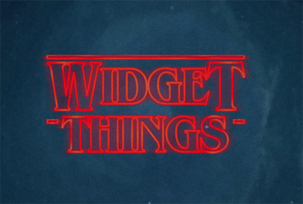
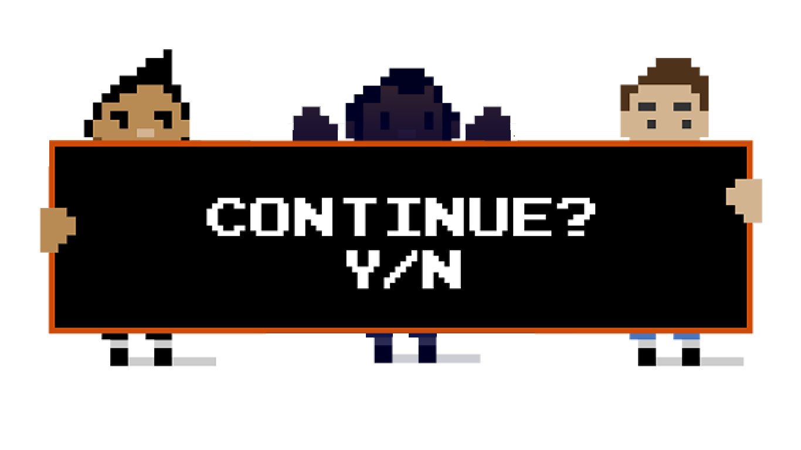
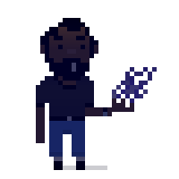
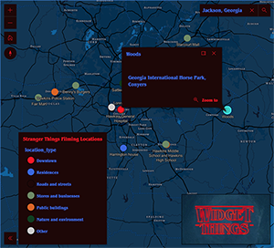
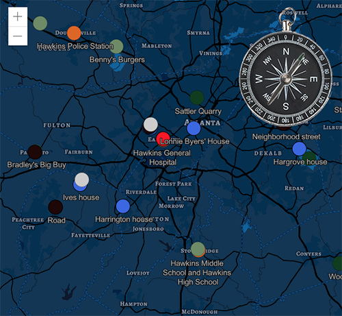

<!-- .slide: data-background="../node_modules/esri-reveal.js-templates/img/2019/devsummit/bg-1.png" data-background-size="cover" style="padding-left: 80px;" -->
<!-- Presenter: JC Franco -->

# ArcGIS API for JavaScript: Customizing Widgets

### Matt Driscoll – [@driskull](https://twitter.com/driskull)

### JC Franco – [@arfncode](https://twitter.com/arfncode)

---

# Agenda



**Warning:** Stranger Things ahead...

---

# Agenda

- What can be customized
- Customization approaches with demos
- Q & A

---

# Customizing Widgets

- Theming <!-- .element: class="fragment" data-fragment-index="1" -->
  - Changing styles: colors, sizing, font, etc.
- Altering presentation of a widget <!-- .element: class="fragment" data-fragment-index="2" -->
  - Customizing view
  - New view
- Extending <!-- .element: class="fragment" data-fragment-index="3" -->
  - Adding additional functionality

---

# Customization Approaches

- Authoring a theme <!-- .element: class="fragment" data-fragment-index="1" -->
- Recreating a view <!-- .element: class="fragment" data-fragment-index="2" -->
- Extending a view <!-- .element: class="fragment" data-fragment-index="3" -->

---



<!-- .slide: data-background="img/upside-down-bg.jpg" data-background-size="cover"  -->

---

<h1>Act I</h1>


<h2>Theming</h2>

<!-- .slide: data-background="img/upside-down-bg.jpg" data-background-size="cover"  -->

---

# ActI: Theming

## Why Theme? <!-- .element: class="fragment" data-fragment-index="0" -->

- Match branding.
- Match the map.
- Contrast with the map.
- Based on the environment.
- User-specific (e.g. bigger buttons)

<!-- .element: class="fragment" data-fragment-index="1" -->

---

# Esri Themes

10 themes are provided out-of-the-box:

Using a theme requires only a slight update to the CSS path.

```html
<link rel="stylesheet" href="https://js.arcgis.com/4.11/esri/themes/<theme-name>/main.css">
```

---

<!-- .slide: data-background="img/demo-time.png" data-background-size="cover" style="padding-top: 40%;" -->

**Theme Switcher**

[Out-of-the-box themes](../demos/out-of-the-box-themes/)

---

# Theming Technology

---

We use


### to create our CSS.

<!-- .element: class="fragment" data-fragment-index="1" -->
<!-- .element: class="fragment" data-fragment-index="1" -->

<small><a href="https://nodejs.org/">nodejs.org</a> | <a href="https://gruntjs.com/">gruntjs.com</a></small><!-- .element: class="fragment" data-fragment-index="1" -->

---


### is a powerful scripting language for compiling CSS.

- It's modular.
- It's DRY.
- It makes theming easy.

<!-- .element: class="fragment" data-fragment-index="1" -->

---

# Theming Steps

1.  Get our theme utility.
1.  Use the utility.
1.  Customize your theme.
1.  Host your CSS file.

<!-- .element: class="fragment" data-fragment-index="1" -->

---

# Theming Setup

1.  Clone the utility `jsapi-styles.git`
1.  Run `npm install`
1.  Edit <span style="font-weight:bold;">`sass/my-theme/main.scss`</span>.
1.  See <span style="font-weight:bold;">`dist/my-theme/main.css`</span>.

<!-- .element: class="fragment" data-fragment-index="1" -->

---

# Step 1

Clone the repo.<br/>
<a href="https://github.com/jcfranco/jsapi-styles" target="_blank">https://github.com/jcfranco/jsapi-styles</a>

```
git clone https://github.com/jcfranco/jsapi-styles.git
```

---

# Step 2

`npm install`

- Installs the necessary bits.
- Creates a sample theme directory.
- Compiles the CSS from the SCSS.
- Spins up a preview in your default browser.

<!-- .element: class="fragment" data-fragment-index="1" -->

---

# Step 3

Edit your theme.<br/>
`sass/my-theme/main.scss`

<div>
Optionally, edit your app.<br/>
`preview/index.html`
</div><!-- .element: class="fragment" data-fragment-index="1" -->

---

# Step 4

Host your stylesheet and any relevant assets.

Link your stylesheet in your app.

```html
<!-- In your app: -->
<link href="path/to/your/theme/main.css" rel="stylesheet">
```

---

# Goals

Theme Smart

- Avoid adding additional CSS selectors
- Instead, use Sass to your advantage

---

# Theme Structure

Let's look at how the core theme is structured

- Color <span>: `color.scss`</span><!-- .element: class="fragment" data-fragment-index="1" -->
- Size <span>: `sizes.scss`</span><!-- .element: class="fragment" data-fragment-index="1" -->
- Type <span>: `type.scss`</span><!-- .element: class="fragment" data-fragment-index="1" -->

---

# Theme Structure

### Default

```scss
// Inside base/_colorVariables.scss
$background-color: #fff !default;
```

Any value assignment overrides the `!default` value.

```scss
// Inside sass/my-theme/main.scss
$background-color: #1e0707;
```

But wait...there's more!<!-- .element: class="fragment" data-fragment-index="1" -->

---

# Theme Structure

Override the core color variables...

```scss
$font-color                       : #3a5fe5;
$interactive-font-color           : #ff1515;
$background-color                 : #1e0707
$button-color                     : #ff1515;
```

...then magic!<!-- .element: class="fragment" data-fragment-index="1" -->

<!-- .element: class="fragment" data-fragment-index="1" -->

---

# Magic


```scss
$button-color--hover: darken($button-color, 10%) !default;
// ...etc
```

[API Styling Guide](https://jscore.esri.com/javascript/latest/guide/styling/)

---

# Act I: Lets make a theme

Stranger Things Theme

[](../demos/custom-theme/)

**DISCLAIMER**: `theme has low contrast`

---

<!-- .slide: data-background="img/demo-time.png" data-background-size="cover" style="padding-top: 40%;" -->

**Custom Theme**

[Preview](../../jsapi-styles/preview/) | [Demo Steps](../demos/custom-theme/STEPS.md)

---

# Act I: Theming Recap

- Use the utility for easy theming.
- Theme structure
  - Color
  - Size
  - Typography
- Use the core and override values.

---

<!-- NEXT ACT  A -->
<h1>End Act I</h1>


<!-- .slide: data-background="img/upside-down-bg.jpg" data-background-size="cover"  -->

---

<!-- NEXT ACT  B -->
<h1>Act II</h1>


<h2>Views</h2>

<!-- .slide: data-background="img/upside-down-bg.jpg" data-background-size="cover"  -->

---

# Act II: Widget Composition

Widgets are composed of Views & ViewModels

- Separate logic from presentation
- Reusable
- UI replacement
- Framework integration

<!-- .element: class="fragment" data-fragment-index="1" -->

---

# Act II: TypeScript

- Widgets written in TypeScript (Typed JavaScript)
- JS of the future, now <!-- .element: class="fragment" data-fragment-index="1" -->
- IDE support <!-- .element: class="fragment" data-fragment-index="2" -->
  - Visual Studio
  - WebStorm
  - Sublime
  - and more!

---

# Act II: Views

- Presentation of the Widget
- Uses ViewModel APIs to render the UI
- View-specific logic resides here
- Extends `esri/widgets/Widget`

<!-- .element: class="fragment" data-fragment-index="1" -->

---

# Act II: Widget Class

`esri/widgets/Widget`

- Provides lifecycle
- API consistency

<!-- .element: class="fragment" data-fragment-index="1" -->

---

# Act II: Widget Lifecycle

- <!-- .element: class="fragment" data-fragment-index="1" --> `constructor`
- <!-- .element: class="fragment" data-fragment-index="2" --> `postInitialize`
- <!-- .element: class="fragment" data-fragment-index="3" --> `render`
- <!-- .element: class="fragment" data-fragment-index="4" --> `destroy`

---

# Act II: `render`

- Defines UI
- Reacts to state
- Uses JSX
- VDOM

<!-- .element: class="fragment" data-fragment-index="1" -->

---

# Act II: Working with Views

API Exploration

- [Compass Doc](https://developers.arcgis.com/javascript/latest/api-reference/esri-widgets-Compass.html)
- [Compass Sample](https://developers.arcgis.com/javascript/latest/sample-code/widgets-compass-2d/index.html)

---

# Act II: Recreating a view

Custom Stranger Things Compass

[](../demos/custom-compass-complete/)

---

# Act II: Compass Interface

CustomCompass widget: Same interface as the default Compass widget

```ts
interface CustomCompass {
  view: View; //MapView | SceneView
  viewModel: CompassViewModel;
  reset(): void; // CompassViewModel.reset()
}
```

---

<!-- .slide: data-background="img/demo-time.png" data-background-size="cover" style="padding-top: 40%;" -->

Recreating a view

[Demo Start](../demos/custom-compass-start/) | [Demo Steps](../demos/custom-compass-start/STEPS.md)

---

# Act II: Views Recap

What have we learned about Widget Views?

- Face of the widget
- Present ViewModel logic
- ViewModel separation allows framework integration or custom views
- Downloadable on API docs

<!-- .element: class="fragment" data-fragment-index="1" -->

---

<!-- NEXT ACT  A -->
<h1>End Act II</h1>


<!-- .slide: data-background="img/upside-down-bg.jpg" data-background-size="cover"  -->

---

<!-- Presenter: JC -->

<!-- NEXT ACT  B -->
<h1>Act III</h1>


<h2>Extending a View</h2>

<!-- .slide: data-background="img/upside-down-bg.jpg" data-background-size="cover"  -->

---

# Act III: Extending

- Why? <!-- .element: class="fragment" data-fragment-index="1" -->
  - Reusable <!-- .element: class="fragment" data-fragment-index="2" -->
  - Same ecosystem <!-- .element: class="fragment" data-fragment-index="3" -->
- How? <!-- .element: class="fragment" data-fragment-index="4" -->
  - <!-- .element: class="fragment" data-fragment-index="5" --> Leveraging `esri/widgets/Widget`
  - API Widgets <!-- .element: class="fragment" data-fragment-index="6" -->

---

<!-- .slide: data-background="img/demo-time.png" data-background-size="cover" style="padding-top: 40%;" -->

**CustomCompass (Revisited)**

[Steps](https://github.com/jcfranco/dev-summit-2018-customizing-widgets/blob/master/demos/customcompass-extended/STEPS.md)

---

**CustomBasemapGallery**

[Demo](https://jcfranco.github.io/dev-summit-2018-customizing-widgets/demos/custombasemapgallery-end/)
|
[Steps](https://github.com/jcfranco/dev-summit-2018-customizing-widgets/blob/master/demos/custombasemapgallery/STEPS.md)

<!-- .slide: data-background="img/demo-time.png" data-background-size="cover" style="padding-top: 40%;" -->

---

# Act III: Extending a View Recap

- Reusable <!-- .element: class="fragment" data-fragment-index="1" -->
  - View/ViewModel <!-- .element: class="fragment" data-fragment-index="1" -->
- Same ecosystem <!-- .element: class="fragment" data-fragment-index="2" -->
  - No extra libraries <!-- .element: class="fragment" data-fragment-index="2" -->
- Extended existing widget <!-- .element: class="fragment" data-fragment-index="3" -->
  - Lifecycle <!-- .element: class="fragment" data-fragment-index="3" -->
  - TypeScript <!-- .element: class="fragment" data-fragment-index="3" -->

---

<!-- NEXT ACT A -->
<h1>End Act III</h1>


<!-- .slide: data-background="img/upside-down-bg.jpg" data-background-size="cover"  -->

---

<!-- NEXT ACT B -->
<h1>The End?</h1>


<!-- .slide: data-background="img/upside-down-bg.jpg" data-background-size="cover"  -->

---

# Conclusion

- Authored a theme <!-- .element: class="fragment" data-fragment-index="1" -->
- Extended a view <!-- .element: class="fragment" data-fragment-index="2" -->
- Recreated a view <!-- .element: class="fragment" data-fragment-index="3" -->

---

## Recommended Sessions

- [Intro to TypeScript](https://devsummit2019.schedule.esri.com/schedule/996246169) Wed 1:30pm
- [JavaScript for Geographers](https://devsummit2019.schedule.esri.com/schedule/237520120) Wed 2:30 pm
- [Using TypeScript with ArcGIS API for JavaScript](https://devsummit2019.schedule.esri.com/schedule/1194566856) Wed 2:30 pm
- [Accessible Web Mapping Apps](https://devsummit2019.schedule.esri.com/schedule/672667633) Thu 9am
- [Building Your own Widget with ArcGIS API for JavaScript](https://devsummit2019.schedule.esri.com/schedule/822290096) Thu 4pm

---

## Additional Resources

- [Implementing Accessor](https://developers.arcgis.com/javascript/latest/guide/implementing-accessor/index.html)
- [Setting up TypeScript](https://developers.arcgis.com/javascript/latest/guide/typescript-setup/index.html)
- [Widget Development](https://developers.arcgis.com/javascript/latest/guide/custom-widget/index.html)
- [JS API SDK](https://developers.arcgis.com/javascript/)

---

<!-- **please rate us** -->
<!-- .slide: data-background="../node_modules/esri-reveal.js-templates/img/2019/devsummit/bg-rating.png" data-background-size="cover" style="padding-left: 80px;" -->

---

# Questions?

##### For example

> 👓 Where's Barbara? 😭

> 🤔 Where can I find the slides/source?

👉 [bit.ly/customwidgetsds19](http://bit.ly/customwidgetsds19) 👈

---

<!-- .slide: data-background="../node_modules/esri-reveal.js-templates/img/2019/devsummit/bg-esri.png" data-background-size="cover" style="padding-left: 80px;" -->
