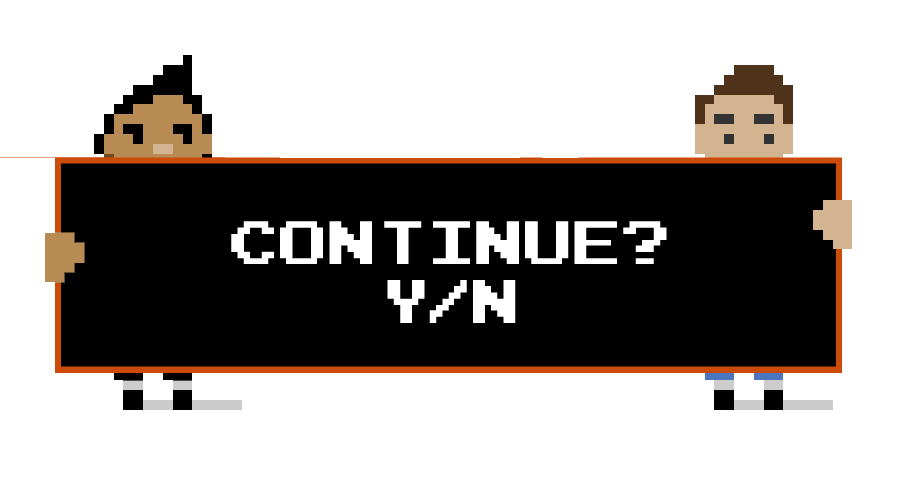
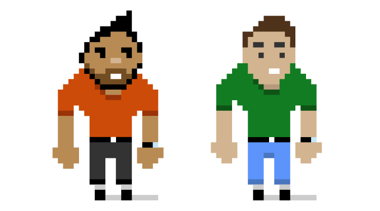
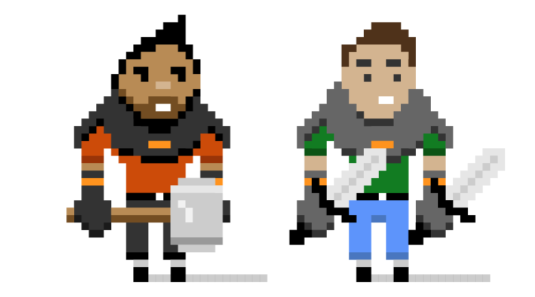
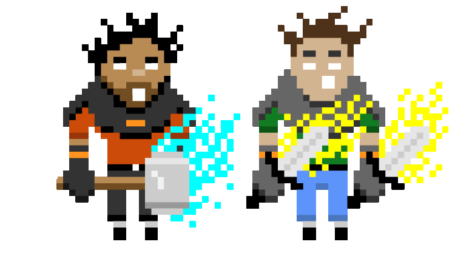

<!-- .slide: data-background="../node_modules/esri-reveal.js-templates/img/2019/devsummit/bg-1.png" data-background-size="cover" style="padding-left: 80px;" -->
<!-- Presenter: Matt -->

# ArcGIS API for JavaScript: Customizing Widgets

### Matt Driscoll – [@driskull](https://twitter.com/driskull)

### JC Franco – [@arfncode](https://twitter.com/arfncode)

---

# Agenda

- What can be customized
- Customization approaches with demos
- Q & A

---

# Customizing Widgets

- Theming <!-- .element: class="fragment" data-fragment-index="1" -->
  - Changing styles: colors, sizing, font, etc.
- Extending <!-- .element: class="fragment" data-fragment-index="2" -->
  - Adding additional functionality
- Altering presentation of a widget <!-- .element: class="fragment" data-fragment-index="3" -->
  - Customizing view
  - New view

---

# Customization Approaches

- Authoring a theme <!-- .element: class="fragment" data-fragment-index="1" -->
- Extending a view <!-- .element: class="fragment" data-fragment-index="2" -->
- Recreating a view <!-- .element: class="fragment" data-fragment-index="3" -->

---



---

<h1 class="eight-bit">Level I</h1>


<h2 class="eight-bit">Theming</h2>

---

# Level I: Theming

## Why Theme? <!-- .element: class="fragment" data-fragment-index="0" -->

- Match branding. <!-- .element: class="fragment" data-fragment-index="1" -->
- Match the map. <!-- .element: class="fragment" data-fragment-index="2" -->
- Contrast with the map. <!-- .element: class="fragment" data-fragment-index="3" -->
- Based on the environment. <!-- .element: class="fragment" data-fragment-index="4" -->
- User-specific (e.g. bigger buttons) <!-- .element: class="fragment" data-fragment-index="5" -->

---

# Theming Technology

---

We use


### to create our CSS.

<!-- .element: class="fragment" data-fragment-index="1" -->
<!-- .element: class="fragment" data-fragment-index="1" -->

<small><a href="https://nodejs.org/">nodejs.org</a> | <a href="https://gruntjs.com/">gruntjs.com</a></small><!-- .element: class="fragment" data-fragment-index="1" -->

---


### is a powerful scripting language for compiling CSS.

- It's modular. <!-- .element: class="fragment" data-fragment-index="1" -->
- It's DRY. <!-- .element: class="fragment" data-fragment-index="2" -->
- It makes theming easy. <!-- .element: class="fragment" data-fragment-index="3" -->

---

# Theming Steps

1.  Get our theme utility. <!-- .element: class="fragment" data-fragment-index="1" -->
1.  Use the utility. <!-- .element: class="fragment" data-fragment-index="2" -->
1.  Customize your theme. <!-- .element: class="fragment" data-fragment-index="3" -->
1.  Host your CSS file. <!-- .element: class="fragment" data-fragment-index="4" -->

---

# Theming Setup

1.  Clone the utility `jsapi-styles.git`
1.  Run `npm install`
1.  Edit <span style="font-weight:bold;">`sass/my-theme/main.scss`</span>.
1.  See <span style="font-weight:bold;">`dist/my-theme/main.css`</span>.

<span>You won't need the base stylesheet.</span><!-- .element: class="fragment" data-fragment-index="1" -->

---

# Step 1

Clone the repo.<br/>
<a href="https://github.com/jcfranco/jsapi-styles" target="_blank">https://github.com/jcfranco/jsapi-styles</a>

<div>
```
git clone https://github.com/jcfranco/jsapi-styles.git
```
</div><!-- .element: class="fragment" data-fragment-index="1" -->

---

# Step 2

`npm install`

<div>
  - Installs the necessary bits.
  - Creates a sample theme directory.
  - Compiles the CSS from the SCSS.
  - Spins up a preview in your default browser.
</div><!-- .element: class="fragment" data-fragment-index="1" -->

---

# Step 3

Edit your theme.<br/>
`sass/my-theme/main.scss`

<div>
Optionally, edit your app.<br/>
`preview/index.html`
</div><!-- .element: class="fragment" data-fragment-index="1" -->

---

# Step 4

Host your stylesheet and any relevant assets.

Link your stylesheet in your app.

```
<!-- In your app: -->
<link href="path/to/your/theme/main.css" rel="stylesheet">
```

---

# Let's have a look!

---

# Theme Smart

Avoid adding additional CSS selectors.<br/>
Instead, use Sass to your advantage.<br/>
<span>Let's look at how the core theme is structured.</span><!-- .element: class="fragment" data-fragment-index="1" -->

---

# Theme Structure

- Color <span>: `colorVariables.scss`</span><!-- .element: class="fragment" data-fragment-index="1" -->
- Size <span>: `sizes.scss`</span><!-- .element: class="fragment" data-fragment-index="1" -->
- Type <span>: `type.scss`</span><!-- .element: class="fragment" data-fragment-index="1" -->

---

# Theme Structure

### Default

```
// Inside base/_colorVariables.scss
$background_color : #fff !default ;
```

Any value assignment overrides the `!default` value.

```
// Inside sass/my-theme/main.scss
$background_color : #cc4b09;
```

But wait...there's more!<!-- .element: class="fragment" data-fragment-index="1" -->

---

# Theme Structure

Override the four main color variables...

```
$text_color            : #fff;    // white
$background_color      : #cc4b09; // mario
$anchor_color          : #ffbaaa; // luigi
$button_text_color     : #ffbaaa; // luigi
```

<span>...then magic!</span><!-- .element: class="fragment" data-fragment-index="1" -->

<!-- .element: class="fragment" data-fragment-index="1" -->

---

# Magic


```
  $button_text_hover_color: offset-foreground-color($button_text_color, 25%) !default;
  $anchor_hover_color: offset-foreground-color($anchor_color, 25%) !default;
  $background_hover_color: offset-background-color($background_color, 5%) !default;
// etc.
```

<a href="https://developers.arcgis.com/javascript/latest/guide/styling/index.html#sassy-widgets" target="_blank">Theming Guide</a>

---

# So let's make a theme!

---

# Level I: Theming Recap

- Use the utility for easy theming. <!-- .element: class="fragment" data-fragment-index="1" -->
- Theme structure <!-- .element: class="fragment" data-fragment-index="2" -->
  - Color <!-- .element: class="fragment" data-fragment-index="2" -->
  - Size <!-- .element: class="fragment" data-fragment-index="2" -->
  - Typography <!-- .element: class="fragment" data-fragment-index="2" -->
- Use the core and override values. <!-- .element: class="fragment" data-fragment-index="3" -->

---

<!-- LEVEL UP A -->
<h1 class="eight-bit">LEVEL UP!</h1>


<h2 class="eight-bit">Ready?</h2>

---

<!-- LEVEL UP B -->
<h1 class="eight-bit">LEVEL II</h1>



<h2 class="eight-bit">Views</h2>

---

<!-- Presenter: Matt -->

# Level II: Widget Composition

Widgets are composed of Views & ViewModels <!-- .element: class="fragment" data-fragment-index="0" -->

- Reusable <!-- .element: class="fragment" data-fragment-index="1" -->
- UI replacement <!-- .element: class="fragment" data-fragment-index="2" -->
- Framework integration <!-- .element: class="fragment" data-fragment-index="3" -->

---

# Level II: Views

- Presentation of the Widget <!-- .element: class="fragment" data-fragment-index="1" -->
- Uses ViewModel APIs to render the UI <!-- .element: class="fragment" data-fragment-index="2" -->
- View-specific logic resides here <!-- .element: class="fragment" data-fragment-index="3" -->

---

# Level II: Working with Views

API Exploration

- [Attribution Doc](https://developers.arcgis.com/javascript/latest/api-reference/esri-widgets-Attribution.html)
- [Attribution Sample](https://developers.arcgis.com/javascript/latest/sample-code/widgets-layerlist/index.html)

---

# Level II: Extending a View

---

---

# Demo

---

# Level II: Views Recap

What have we learned about Widget Views? <!-- .element: class="fragment" data-fragment-index="0" -->

- Face of the widget <!-- .element: class="fragment" data-fragment-index="2" -->
- Present ViewModel logic <!-- .element: class="fragment" data-fragment-index="3" -->
- ViewModel separation allows framework integration or custom views <!-- .element: class="fragment" data-fragment-index="4" -->
- Downloadable on API docs <!-- .element: class="fragment" data-fragment-index="5" -->

---

<!-- LEVEL UP A -->
<h1 class="eight-bit">LEVEL UP!</h1>


<h2 class="eight-bit">Ready?</h2>

---

<!-- LEVEL UP B -->
<h1 class="eight-bit">LEVEL III</h1>



<h2 class="eight-bit">Extending a View</h2>

---

<!-- Presenter: JC -->

# Level III: Recreating a View

- Why? <!-- .element: class="fragment" data-fragment-index="1" -->
  - Reusable <!-- .element: class="fragment" data-fragment-index="2" -->
  - Same ecosystem <!-- .element: class="fragment" data-fragment-index="3" -->
- How? <!-- .element: class="fragment" data-fragment-index="4" -->
  - JS API v4.7 <!-- .element: class="fragment" data-fragment-index="5" -->
  - <!-- .element: class="fragment" data-fragment-index="5" --> `esri/widgets/Widget`
  - TypeScript <!-- .element: class="fragment" data-fragment-index="5" -->

---

`esri/widgets/Widget`

- Provides lifecycle <!-- .element: class="fragment" data-fragment-index="1" -->
- API consistency <!-- .element: class="fragment" data-fragment-index="2" -->

---

# Lifecycle

- <!-- .element: class="fragment" data-fragment-index="1" --> `constructor`
- <!-- .element: class="fragment" data-fragment-index="2" --> `postInitialize`
- <!-- .element: class="fragment" data-fragment-index="3" --> `render`
- <!-- .element: class="fragment" data-fragment-index="4" --> `destroy`

---

# `render`

- Defines UI <!-- .element: class="fragment" data-fragment-index="1" -->
- Reacts to state <!-- .element: class="fragment" data-fragment-index="2" -->
- Uses JSX <!-- .element: class="fragment" data-fragment-index="3" -->
- VDOM <!-- .element: class="fragment" data-fragment-index="4" -->

---

# TypeScript

- Typed JavaScript <!-- .element: class="fragment" data-fragment-index="1" -->
- JS of the future, now <!-- .element: class="fragment" data-fragment-index="2" -->
- IDE support <!-- .element: class="fragment" data-fragment-index="3" -->
  - Visual Studio <!-- .element: class="fragment" data-fragment-index="3" -->
  - WebStorm <!-- .element: class="fragment" data-fragment-index="3" -->
  - Sublime <!-- .element: class="fragment" data-fragment-index="3" -->
  - and more! <!-- .element: class="fragment" data-fragment-index="3" -->

---

# Demo: Recreating

[Demo](https://jcfranco.github.io/dev-summit-2018-customizing-widgets/demos/custombasemapgallery-end/)
|
[Steps](https://github.com/jcfranco/dev-summit-2018-customizing-widgets/blob/master/demos/custombasemapgallery-start/STEPS.md)

<!-- .slide: data-background="../node_modules/esri-reveal.js-templates/img/2019/devsummit/bg-2.png" data-background-size="cover" style="padding-left: 80px;"  -->

---

# Level III: Recreating a View Recap

- Reusable <!-- .element: class="fragment" data-fragment-index="1" -->
  - View/ViewModel <!-- .element: class="fragment" data-fragment-index="1" -->
- Same ecosystem <!-- .element: class="fragment" data-fragment-index="2" -->
  - No extra libraries <!-- .element: class="fragment" data-fragment-index="2" -->
- Extended existing widget <!-- .element: class="fragment" data-fragment-index="3" -->
  - Lifecycle <!-- .element: class="fragment" data-fragment-index="3" -->
  - TypeScript <!-- .element: class="fragment" data-fragment-index="3" -->

---

<!-- LEVEL UP A -->
<h1 class="eight-bit">LEVEL UP!</h1>


<h2 class="eight-bit">Ready?</h2>

---

<!-- LEVEL UP B -->
<h1 class="eight-bit">LEVEL IV</h1>



<h2 class="eight-bit">Put it all together.</h2>

---

# Conclusion

- Authored a theme <!-- .element: class="fragment" data-fragment-index="1" -->
- Extended a view <!-- .element: class="fragment" data-fragment-index="2" -->
- Recreated a view <!-- .element: class="fragment" data-fragment-index="3" -->

---

## Additional Resources

- [Implementing Accessor](https://developers.arcgis.com/javascript/latest/guide/implementing-accessor/index.html)
- [Setting up TypeScript](https://developers.arcgis.com/javascript/latest/guide/typescript-setup/index.html)
- [Widget Development](https://developers.arcgis.com/javascript/latest/guide/custom-widget/index.html)
- [JS API SDK](https://developers.arcgis.com/javascript/)

---

<!-- **please rate us** -->
<!-- .slide: data-background="../node_modules/esri-reveal.js-templates/img/2019/devsummit/bg-rating.png" data-background-size="cover" style="padding-left: 80px;" -->

---

# Questions?

##### For example

> 🤔 Where can I find the slides/source?

👉 [bit.ly/customwidgetsds19](http://bit.ly/customwidgetsds19) 👈

---

<!-- data-background="../node_modules/esri-reveal.js-templates/img/2019/devsummit/bg-esri.png" data-background-size="cover" style="padding-left: 80px;" -->
